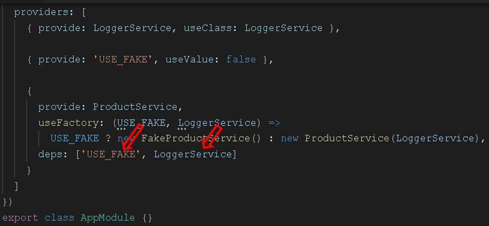

# Rickandmorty3

This project was generated with [Angular CLI](https://github.com/angular/angular-cli) version 15.0.0.
## Tutorial  injection Token
* https://www.tektutorialshub.com/angular/angular-providers/
* https://www.tektutorialshub.com/angular/injection-token-in-angular/
* https://www.youtube.com/watch?v=P6m3H5jJMWk
* https://country-code.ghost.io/angular-injection-token-use-cases/
* https://medium.com/ngconf/configure-your-angular-apps-with-an-injection-token-be16eee59c40

## Angular Providers: useClass, useValue, useFactory & useExisting

What are Angular Providers

The Angular Provider is an instruction (or recipe) that describes how an object for a certain token is created. The Angular Providers is an array of such instructions (Provider). Each provider is uniquely identified by a token (or DI  Token ) in the Providers Array.

We register the services participating in the dependency injections in the Providers metadata. There are two ways by which we can do it.

    Register directly in the Providers array of the @NgModule or @Component or in @Directive.  
    Or use the providedIn property of the @Injectable decorator.

The Angular creates an Injector for each component/directive it creates. It also creates a root-level injector, which has the app-level scope. It also creates a Module level Injector for Lazy Loaded Modules.

Each Injector gets its own copy of the Providers. We can the same dependency with multiple providers. Where & how you register the dependency defines the scope of the dependency

The Angular Components or Angular Services declare the dependencies they need in their constructor. The Injector reads the dependencies and looks for the provider in the providers array using the Token. It then instantiates the dependency using the instructions provided by the provider. The Injector then injects the instance of the dependency into the Components/Services.
Configuring the Angular Provider

To Provide an instance of the dependency, we need to register it in the Providers metadata 

In our last tutorial on Angular Dependency injection, we registered our ProductService using the Providers arrays as shown below in the @NgModule

```
 providers: [ProductService]

```

The above is an actual shorthand notation for the following syntax

```
providers :[{ provide: ProductService, useClass: ProductService }]
``` 
The above syntax has two properties.
### Provide

The first property is Provide holds the Token or DI Token. The Injector uses the token to locate the provider in the Providers array. The Token can be either a type, a string or an instance of InjectionToken.
### Provider

The second property is the Provider definition object. It tells Angular how to create the instance of the dependency. The Angular can create the instance of the dependency in four different ways. It can create a dependency from the existing service class (useClass). It can inject a value, array, or object (useValue). It can use a factory function, which returns the instance of service class or value (useFactory). It can return the instance from an already existing token (useExisting).

### DI Token

The Injector maintains an internal collection of token-provider in the Providers array. The token acts as a key to that collection & Injector use that Token (key) to locate the Provider.

The DI Token can be either type, a string or an instance of InjectionToken.
### Type Token

Here the type being injected is used as the token.

For Example, we would like to inject the instance of the ProductService, we will use the ProducService as the token as shown below
``` 
 
providers :[{ provide: ProductService, useClass: ProductService }]
``` 
 

The ProductService is then injected to the component by using the following code.
``` 
class ProductComponent {
  constructor(private productService : ProductService ) {}
}
```
 
### String token

Instead of using a type, we can use a string literal to register the dependency. This is useful in scenarios where the dependency is a value or object etc, which is not represented by a class.

Example

``` 
 {provide:'PRODUCT_SERVICE', useClass: ProductService }, 
 {provide:'USE_FAKE', useValue: true },   
 {provide:'APIURL', useValue: 'http://SomeEndPoint.com/api' },    
 ```

You can then use the Inject the dependency using the @Inject method
	
``` 
class ProductComponent {
   constructor(@Inject('PRODUCTSERVICE') private prdService:ProductService,
@Inject('APIURL') private apiURL:string ) { 
}
 
 ```
### Injection Token

The Problem with the string tokens is that two developers can use the same string token at a different part of the app. You also do not have any control over the third-party modules, which may use the same token. If the token is reused, the last to register overwrites all previously registered tokens.

The Angular provides InjectionToken class so as to ensure that the Unique tokens are created. The Injection Token is created by creating a new instance of the InjectionToken class.
	
``` 
export const API_URL= new InjectionToken<string>(''); 
 
```
Register the token in the providers array.

	
``` 
providers: [ 
    { provide: API_URL, useValue: 'http://SomeEndPoint.com/api' }
]
 ```

It is then injected using the @Inject in the constructor of the service/component.
```	
 
constructor(@Inject(API_URL) private apiURL: string) { 
}
```
 
### The Types of Provider 

The Angular Dependency Injection provides several types of providers.

    Class Provider : useClass
    Value Provider: useValue
    Factory Provider: useFactory
    Aliased Class Provider: useExisting

## Class Provider: useClass

Use the Class Provider useClass, when you want to provide an instance of the provided class.

The useClass expects us to provide a type. The Injector creates a new instance from the type and injects it. It is similar to calling the new operator and returning instance. If the type requires any constructor parameters, the injector will resolve that also.
### UseClass Example

	
 ```
providers :[{ provide: ProductService, useClass: ProductService }]
 ```


In the above, example ProductService is the Token (or key) and it maps to the ProductService Class. In this case both the Class name and token name match.

The Angular Provides a shortcut in cases where both token & class name matches as follows

	
``` 
providers: [ProductService]
``` 
## Switching Dependencies

You can provide a mock/Fake class for Testing purposes as shown below.

	
``` 
providers :[{ provide: ProductService, useClass: fakeProductService }]
``` 


The above example shows us how easy to switch dependencies.

## Value Provider: useValue

Use the Value Provider useValue, when you want to provide a simple value.

The Angular will injects whatever provided in the useValue as it is.

It is useful in scenarios like, where you want to provide API URL, application-wide configuration Option, etc

### UseValue Example

In the example below, we pass a boolean value using token USE_FAKE. You can check the StackBlitz for the source code

	
``` 
providers :[ {provide:'USE_FAKE', useValue: true}]
``` 

We can inject it into the AppComponent using the @Inject

``` 
export class AppComponent {
  constructor(
    @Inject('USE_FAKE') public useFake: string
  ) {}
 
```
You can pass an object. Use Object.freeze to freeze the value of the configuration, so that nobody can change it.

```	
 
const APP_CONFIG =  Object.freeze({
  serviceURL: 'www.serviceUrl.comapi',
  IsDevleomentMode: true
});
 ```

Register it.
	
``` 
  providers: [
    { provide: 'APP_CONFIG', useValue: APP_CONFIG }
  ]
 
```
Inject it as shown below

	
``` 
export class AppComponent {  
constructor(
    @Inject('APP_CONFIG') public appConfig: any
  ) {}
}
```
You can also provide a function

	
``` 
  providers: [
    {
      provide: 'FUNC',
      useValue: () => {
        return 'hello';
      }
    }
  ]
 ```

The Injector will inject the function as it is. You need to invoke the function someFunc() to get a value from it.
	
``` 
export class AppComponent {
  constructor(
    @Inject('FUNC') public someFunc: any
  ) {
    console.log(someFunc());
  }
}
``` 


## Factory Provider: useFactory

The Factory Provider useFactory expects us to provide a function. It invokes the function and injects the returned value. We can also add optional arguments to the factory function using the deps array. The deps array specifies how to inject the arguments.

We usually use the useFactory when we want to return an object based on a certain condition.

### UseFactory example

Consider the use case where we want to inject either ProductService or FakeProductService based on the value for USE_FAKE. Also, one of the service (ProductService ) requires another service (LoggerService). Hence we need to inject USE_FAKE & LoggerService into our factory function.

You can refer to Stackblitz for the example

	
``` 
  providers: [
    { provide: LoggerService, useClass: LoggerService },
 
    { provide: 'USE_FAKE', useValue: true },
 
    {
      provide: ProductService,
      useFactory: (USE_FAKE, LoggerService) =>
        USE_FAKE ? new FakeProductService() : new ProductService(LoggerService),
      deps: ['USE_FAKE', LoggerService]
    }
  ]
 ```


We need to pass all the dependency of the as the argument to the factory function. The injector uses the deps array (third argument) to resolve the dependencies and inject them.

	
``` 
useFactory: (USE_FAKE, LoggerService)
``` 

inside the factory function, we either return FakeProductService or ProductService depending on the value of USE_FAKE
	
``` 
=>
   USE_FAKE ? new FakeProductService() : new ProductService(LoggerService)
``` 

In the last option, we need to tell the Injector how to inject the dependencies of the Factory function itself. Note that order must be the same as that of the factory function argument.
	
``` 
deps: ['USE_FAKE', LoggerService]
```


The above example can also be written as follows.

``` 
export function resolveProductService(USE_FAKE, LoggerService) {
  return USE_FAKE
    ? new FakeProductService()
    : new ProductService(LoggerService);
}

 
 
 
  providers: [
    { provide: LoggerService, useClass: LoggerService },
 
    { provide: 'USE_FAKE', useValue: false },
 
    {
      provide: ProductService,
      useFactory: resolveProductService,
      deps: ['USE_FAKE', LoggerService]
    }
  ]
 ```
 
## useFactory Vs useValue

In the useValue example, we used the following code.

	
``` 
  providers: [
    {
      provide: 'FUNC',
      useValue: () => {
        return 'hello';
      }
    }
  ]
``` 

The useValue returns the function as it is. You need to call the function (someFunc()) to get the value.
	
``` 
export class AppComponent {
  constructor(
    @Inject('FUNC') public someFunc: any
  ) {
    console.log(someFunc());
  }
}
``` 

You can achieve the same with the useFactory

	
``` 
  providers: [
    {
      provide: 'FUNC',
      useFactory: () => {
        return 'hello';
      }
    }
  ]
 ```

The useFactory invokes the factory function and returns the result. Hence in the component, you will receive the value of the function and not the function itself.
	
``` 
export class AppComponent {
  constructor(
    @Inject('FUNC') public someFunc: any
  ) {
    console.log(someFunc);
  }
}
``` 
## Aliased Provider: useExisting

Use Aliased Provider useExisting when you want to use the new provider in place of the old Provider.
### UseExisting Example

	
``` 
  providers: [
    { provide: ProductService, useExisting: NewProductService },
    { provide: NewProductService, useClass: NewProductService },
``` 


For Example, in the above example, we map the ProductService to the NewProductService token using useExisting Provider. This will return the NewProductService whenever we use the ProductService.

Also, note that we need to pass the token to the useExisting and not type. The following example shows useExisting with string tokens.

``` 
  providers: [
    { provide: ProductService, useExisting: 'PRODUCT_SERVICE' },
    { provide: 'PRODUCT_SERVICE', useClass: NewProductService },
 ```

Multiple Providers with the same token

You can add as many dependencies to the Providers array.

The Injector does not complain, if you add more than one provider with the same token

For example, NgModule below adds both ProductService & FakeProductService using the same token ProductService.

	
``` 
@NgModule({
 
  ... 
  providers: [
    { provide: ProductService, useClass: ProductService },
    { provide: ProductService, useClass: FakeProductService },
  
  ]
})
export class AppModule {}
```

In such a scenario, the last to register wins. The ProductService token always injects FakeProductService because we register it last.
Registering the Dependency at Multiple Providers

You can also register a Dependency with Multiple Providers.

For Example, here we register the ProductService in NgModule
	
``` 
@NgModule({
 
  ... 
  providers: [
    { provide: ProductService, useClass: ProductService },  
  ]
})
export class AppModule {}
``` 

We can also go and register it in AppComponent. In this case, AppComponent always gets the dependency registered in the component itself.
	
``` 
@Component({
  selector: 'my-app',
  templateUrl: './app.component.html',
  providers: [ProductService]
})
export class AppComponent {
  products: Product[];
```

### Provider Scope

Where you register the dependency, defines the lifetime of the dependency.

When we provide the service in the @ngModule of the root module or any eagerly loaded module, the will be available everywhere in the application.

If we provide the services in the @Component, @pipe or @Directive then they are available only in that component and all of its child components

The Services provided in the @ngModule of the lazy loaded module are available in that module only.

### Singleton services

Each Injector creates a singleton object of the dependency registered by the provider.

For Example, consider a service configured in @ngModule. Component A asks for the service it will get a new instance of the service. Now if Component B Asks for the same service, the injector does not create a new instance of the service, but it will reuse the already created service.

But if we register the service in @ngModule and also in Component A. Component A always gets a new instance of the service. While other components gets the instance of the service registered in @ngModule.
### Summary

We learned how to register dependencies using the Angular Providers. You can download the sample code from the Github repository.  In the next tutorial, we will learn about the Angular injector.


## Injection Token

### Type Token

Here the type being injected is used as the token.

For Example, we would like to inject the instance of the ProductService, we will use the ProducService as the token as shown below.
```
providers :[{ provide: ProductService, useClass: ProductService }]
``` 

The ProductService is then injected into the component by using the following code.
```
class ProductComponent {
  constructor(private productService : ProductService ) {}
}
 
``` 
You can keep the same token (ProductService) and change the class to another implementation of the Product service. For Example in the following code, we change it to BetterProductService.

``` 
  providers: [
    { provide: ProductService, useClass: BetterProductService },
 
```
Angular does not complain if we use the token again. In the following example token ProductService used twice. In such a situation last to register wins (BetterProductService).
```
  providers: [
    { provide: ProductService, useClass: ProductService },
    { provide: ProductService, useClass: BetterProductService }
  ]
 ```


### String token

You can use the Type token only if you have Type representation. But that is not the case always. Sometimes we need to inject simple string values or simple object literal, where there is no type.

We can use string tokens in such a scenario.

Example:
``` 
providers: [{ provide: 'PRODUCT_SERVICE', useClass: ProductService }]   
``` 

You can then use the Inject the ProductService using the @Inject method

``` 
export class AppComponent {
  products: Product[];
 
  constructor(
    @Inject('PRODUCT_SERVICE') private productService: ProductService
  ) {}
 ```

Example:
```
 
  providers: [
    { provide: 'PRODUCT_SERVICE', useClass: const CONFIG = {
  apiUrl: 'http://my.api.com',
  fake: true,
  title: 'Injection Token Example'
};
 
@NgModule({
  imports: [BrowserModule, FormsModule],
  declarations: [AppComponent, HelloComponent],
  bootstrap: [AppComponent],
  providers: [
    { provide: 'PRODUCT_SERVICE', useClass: ProductService },
    { provide: 'USE_FAKE', useValue: true },
    { provide: 'APIURL', useValue: 'http://SomeEndPoint.com/api' },
    { provide: 'CONFIG', useValue: CONFIG }
  ]
})
export class AppModule {}
 
```
------------------------------------------------------------
```
export class AppComponent {
  products: Product[];
 
  constructor(
    @Inject('PRODUCT_SERVICE') private productService: ProductService,
    @Inject('USE_FAKE') public fake: String,
    @Inject('APIURL') public ApiUrl: String,
    @Inject('CONFIG') public Config: any
  ) {}
``` 
### Creating an InjectionToken

To Create an Injection Token, first, we need to import InjectionToken from @angular/core
	
``` 
import { InjectionToken } from '@angular/core'; 
 
```
Create a new Injection Token APIURL from InjectionToken
```
export const APIURL = new InjectionToken<string>('');
```

Register it in the providers array.
```
providers: [ 
{ provide: APIURL, useValue: 'http://SomeEndPoint.com/api' },
``` 

Inject it into the Component
``` 
export class AppComponent {
  constructor(@Inject(APIURL) public ApiUrl: String,) { }
}
```
### InjectionToken Example

The following example shows how to use the Injection Token.
	
 ```
 // tokens.ts
 
import { InjectionToken } from '@angular/core';
 
export const APIURL = new InjectionToken<string>('');
export const USE_FAKE = new InjectionToken<string>('');
export const PRODUCT_SERVICE = new InjectionToken<string>('');
export const APP_CONFIG = new InjectionToken<string>('');
 
 ```
```
// app.module.ts

import { NgModule } from '@angular/core';
import { BrowserModule } from '@angular/platform-browser';
import { FormsModule } from '@angular/forms';
 
import { AppComponent } from './app.component';
import { HelloComponent } from './hello.component';
import { ProductService } from './product.service';
import { BetterProductService } from './better-product.service';
import { PRODUCT_SERVICE, USE_FAKE, APIURL, APP_CONFIG } from './tokens';
 
const CONFIG = {
  apiUrl: 'http://my.api.com',
  fake: true,
  title: 'Injection Token Example'
};
 
@NgModule({
  imports: [BrowserModule, FormsModule],
  declarations: [AppComponent, HelloComponent],
  bootstrap: [AppComponent],
  providers: [
    { provide: PRODUCT_SERVICE, useClass: ProductService },
    { provide: USE_FAKE, useValue: true },
    { provide: APIURL, useValue: 'http://SomeEndPoint.com/api' },
    { provide: APP_CONFIG, useValue: CONFIG }
  ]
})
export class AppModule {}
 
```  
--------------------------------------------------------
```
// product.service.ts

import { Product } from './product';

export class ProductService {
  public getProducts() {
    let products: Product[];

    products = [
      new Product(1, 'Memory Card', 500),
      new Product(2, 'Pen Drive', 750),
      new Product(3, 'Power Bank', 100)
    ];

    return products;
  }
}

```
--------------------------------------------------------
```
// app.component.ts

import { Component, Inject } from '@angular/core';
import { ProductService } from './product.service';
import { Product } from './product';
import { PRODUCT_SERVICE, USE_FAKE, APIURL, APP_CONFIG } from './tokens';
 
@Component({
  selector: 'my-app',
  templateUrl: './app.component.html',
  providers: []
})
export class AppComponent {
  products: Product[];
 
  constructor(
    @Inject(PRODUCT_SERVICE) private productService: ProductService,
    @Inject(USE_FAKE) public fake: String,
    @Inject(APIURL) public ApiUrl: String,
    @Inject(APP_CONFIG) public Config: any
  ) {}
 
  getProducts() {
    this.products = this.productService.getProducts();
  }
}

```
----------------------------------------------------------------------------

```
// app.component.html

<div class="container">
  <h1 class="heading"><strong>Angular Services </strong>Demo</h1>

  {{ApiUrl}} <br />
  {{fake}}<br />
  CONFIG Api: {{Config.apiUrl}} Fake: {{Config.fake}} Title: {{Config.title}}
  <br />
  <button type="button" (click)="getProducts()">Get Products</button>

  <div class="table-responsive">
    <table class="table">
      <thead>
        <tr>
          <th>ID</th>
          <th>Name</th>
          <th>Price</th>
        </tr>
      </thead>
      <tbody>
        <tr *ngFor="let product of products;">
          <td>{{product.productID}}</td>
          <td>{{product.name}}</td>
          <td>{{product.price}}</td>
        </tr>
      </tbody>
    </table>
  </div>
</div>

<br /><br /><br /><br /><br /><br />
Read More
<a href="https://www.tektutorialshub.com/angular/injection-token-in-angular/">Injection Token</a>

```
The Injection token ensures that the tokens are always unique. Even if the two libraries use the same name for Angular DI injection system is correctly inject the right dependency. You can refer to the example application
Reference


### Ejemplo de injectionToken
Aquí tienes un ejemplo de cómo se puede utilizar una InjectionToken en una aplicación real de Angular:
```
import { InjectionToken } from '@angular/core';

export interface AppConfig {
  apiUrl: string;
  appName: string;
}

export const APP_CONFIG = new InjectionToken<AppConfig>('AppConfig');

@Injectable({
  providedIn: 'root'
})
export class AppConfigService {
  constructor(@Inject(APP_CONFIG) private config: AppConfig) { }

  get apiUrl(): string {
    return this.config.apiUrl;
  }

  get appName(): string {
    return this.config.appName;
  }
}

```
En este ejemplo, se define una interfaz AppConfig que describe la estructura de la configuración de la aplicación. Luego se crea una InjectionToken llamada APP_CONFIG con el tipo de datos AppConfig.

Se crea un servicio llamado AppConfigService que inyecta la dependencia con el token APP_CONFIG a través de la decoración @Inject. El servicio proporciona métodos para obtener la URL de la API y el nombre de la aplicación a partir de la configuración inyectada.

Para proporcionar la configuración en el módulo principal de la aplicación, puedes hacerlo de la siguiente manera:
```
import { NgModule } from '@angular/core';
import { APP_CONFIG, AppConfig } from './app-config';

const config: AppConfig = {
  apiUrl: 'https://api.example.com',
  appName: 'Mi aplicación'
};

@NgModule({
  providers: [
    { provide: APP_CONFIG, useValue: config }
  ]
})
export class AppModule { }

```

En este ejemplo, se proporciona una instancia de APP_CONFIG en el módulo principal de la aplicación con un objeto de configuración que incluye la URL de la API y el nombre de la aplicación.

Espero que este ejemplo te ayude a entender cómo se puede utilizar una InjectionToken en una aplicación real de Angular. Si tienes más preguntas, no dudes en hacerlas.
## Development server

Run `ng serve` for a dev server. Navigate to `http://localhost:4200/`. The application will automatically reload if you change any of the source files.

## Code scaffolding

Run `ng generate component component-name` to generate a new component. You can also use `ng generate directive|pipe|service|class|guard|interface|enum|module`.

## Build

Run `ng build` to build the project. The build artifacts will be stored in the `dist/` directory.

## Running unit tests

Run `ng test` to execute the unit tests via [Karma](https://karma-runner.github.io).

## Running end-to-end tests

Run `ng e2e` to execute the end-to-end tests via a platform of your choice. To use this command, you need to first add a package that implements end-to-end testing capabilities.

## Further help

To get more help on the Angular CLI use `ng help` or go check out the [Angular CLI Overview and Command Reference](https://angular.io/cli) page.
# angular15-standalone-InjectionToken
